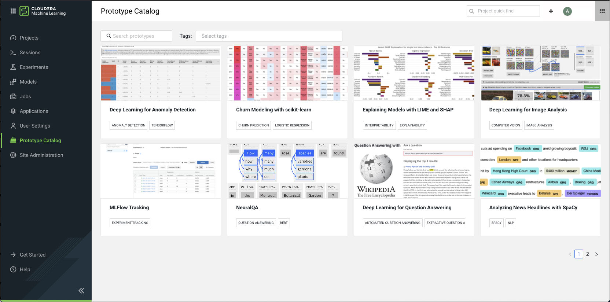

# Applied ML Prototype (AMP) Catalog

AMPs provide **end-to-end ML use cases that can be deployed with one click** directly from Cloudera Machine Learning (CML). They enable data scientists to go from an idea to a fully working ML use case in a fraction of the time it would otherwise take, with an end-to-end framework for building, deploying and monitoring business-ready ML applications.

This repository contains the Cloudera AMP Catalog - a collection of AMPs built in-house by Cloudera's machine learning research team, [Fast Forward Labs](https://www.cloudera.com/products/fast-forward-labs-research.html). For further information on AMPs, visit the official [Cloudera Docs](https://docs.cloudera.com/machine-learning/cloud/applied-ml-prototypes/topics/ml-amps-overview.html).